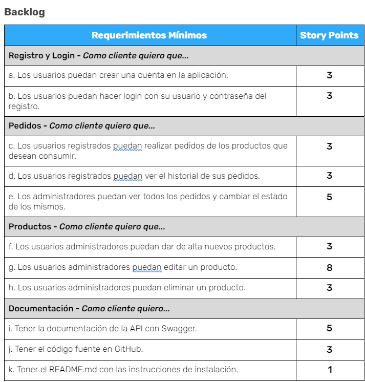
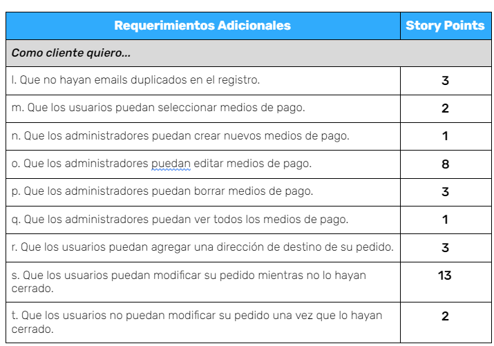
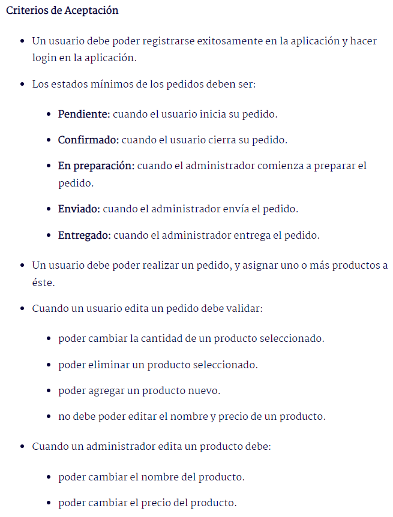
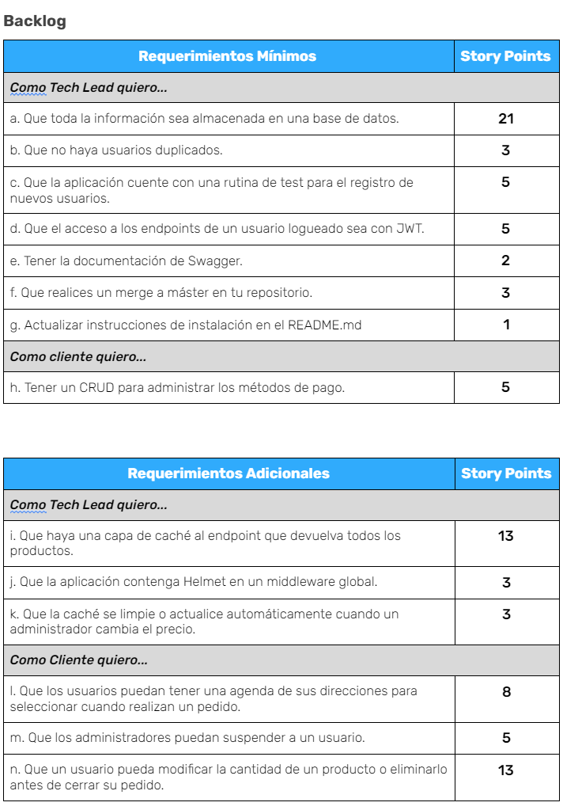
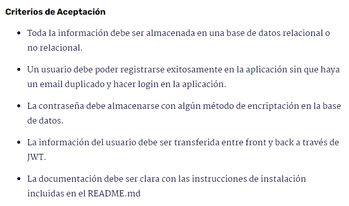
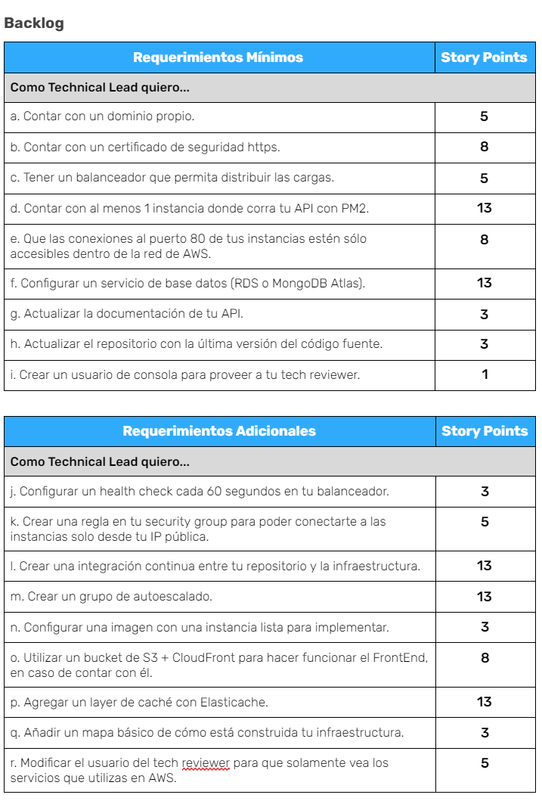
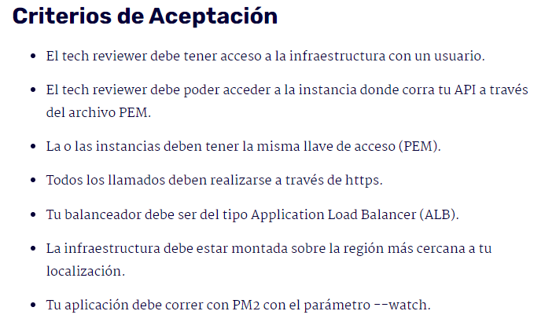
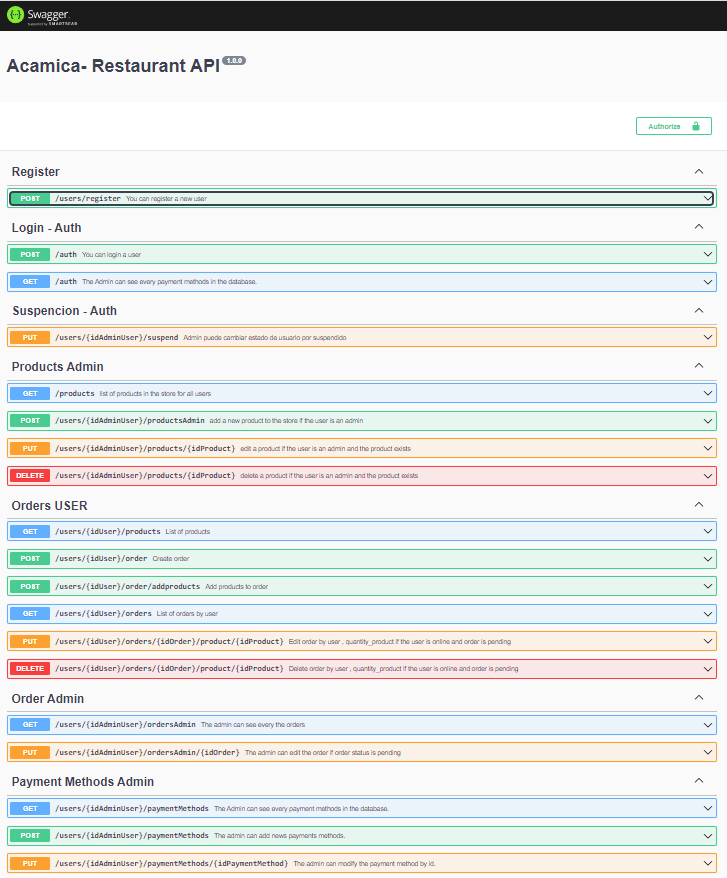

## BACKEND DE UNA APLICACION DE PEDIDOS DE UN RESTAURANTE

Esta aplicacion es parte de un curso de Desarrollo Web BackEnd en Acamica.

Se dividio en 3 partes para que todos lo entiendan de una manera mas clara ya que es el backend y no cuenta con algo visual para el usuario.

<details>
<summary>1. Informacion General</summary>
<br>
En el desarrollo de esta aplicacion se utilizo metodologia Scrum.

<h4>Backlog</h4>
<details>
<summary>Sprint 1</summary>







</details>
<details>
<summary>Sprint 2</summary>





</details>
<details>
<summary>Sprint 3</summary>

[Trello del Sprint 3](https://trello.com/b/iqSzLTJf/sprint-3)





</details>
<details>
<summary>Sprint 4</summary>
En desarrollo
</details>

</details>

<details>
<summary>2. Explicacion para no desarrolladores</summary>

Puede que sepas o no, pero el backend envia un archivo al fronten llamado JSON, se ve algo asi:

imagen json

Por lo tanto el frontend debe de tomar ese archivo y pintarlo en pantalla.

Te preguntaras: ¿Puedo probar el backend? Si, este backend tiene documentacion, para simplificarlo, le permite al frontend que tiene que poner el cliente y comprobar que pasa si por ejemplo pone numeros en lugar de letras

Esto lo hice con una herramienta llamada swagger, que me permite documentarlo
Cuando ingreses veras algo asi :

<details>
<summary>Imagen de muestra de Swagger</summary>



</details>

No te preocupes, te guiare en un par de comprobaciones

[Link del backend](https://www.restaurantedelilahbackend.tk/api-docs/)

</details>

<details>

<summary>3. EXPLICACION PARA DESARROLLADORES</summary>

### API para app de un restaurante.

### Instrucciones de instalación

```
git clone https://github.com/jonatan-c/acamica-sprint1.git
o descargar el repositorio de github
```

```
npm install

```

Crea la base de datos:

```

create database persistencia_sprint2;

```

Importa la base de datos de la carpeta SQL en mysql Workbench

Crea el archivo .env en la carpeta principal e ingresa los siguientes datos:

```

//SERVER
PORT_SERVER=4000

//JWT
SECRETA=secreta

//DB
MYSQL_DB_NAME=persistencia_sprint2
MYSQL_USER="ingrese su usuario"
MYSQL_PASS="ingrese su contraseña"
MYSQL_HOST=localhost
MYSQL_PORT=3306

//REDIS
REDIS_HOST=localhost
REDIS_PORT=6379


```

Por defecto ya viene cargados algunos datos en la base de datos

```

Usuario 1 - Admin - Online --> name: admin , password: admin
Usuario 2 - User - Online --> name:user , password: user

```

Para iniciar app

```

npm run dev

```

Documentancion Swagger

```

http://localhost:4001/api-docs

```

Para correr test

```

npm run test

```

</details>
